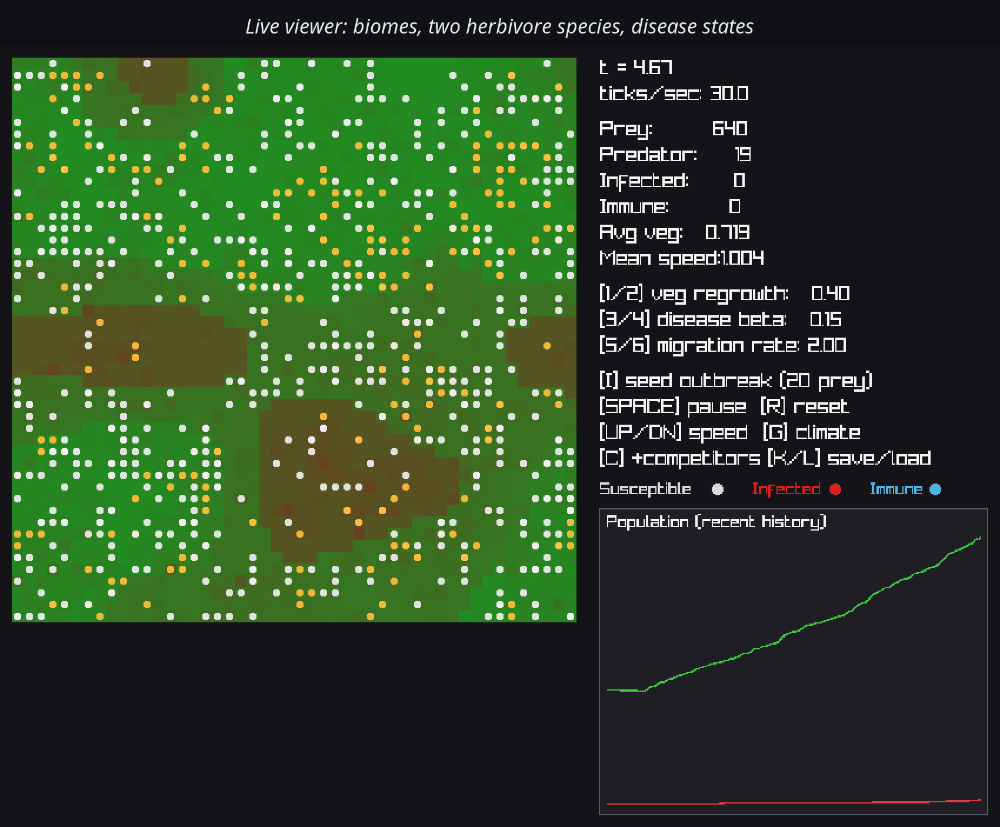
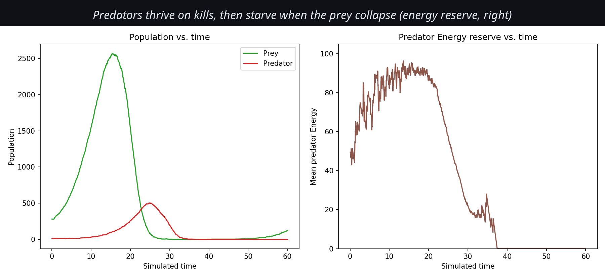
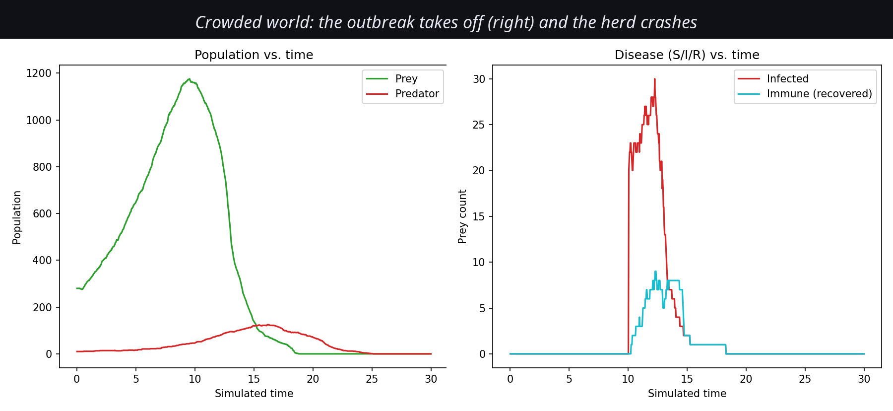
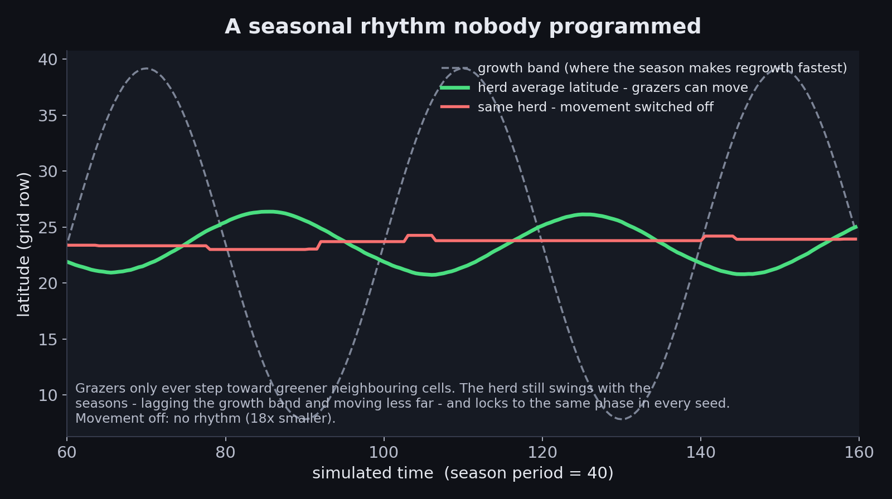
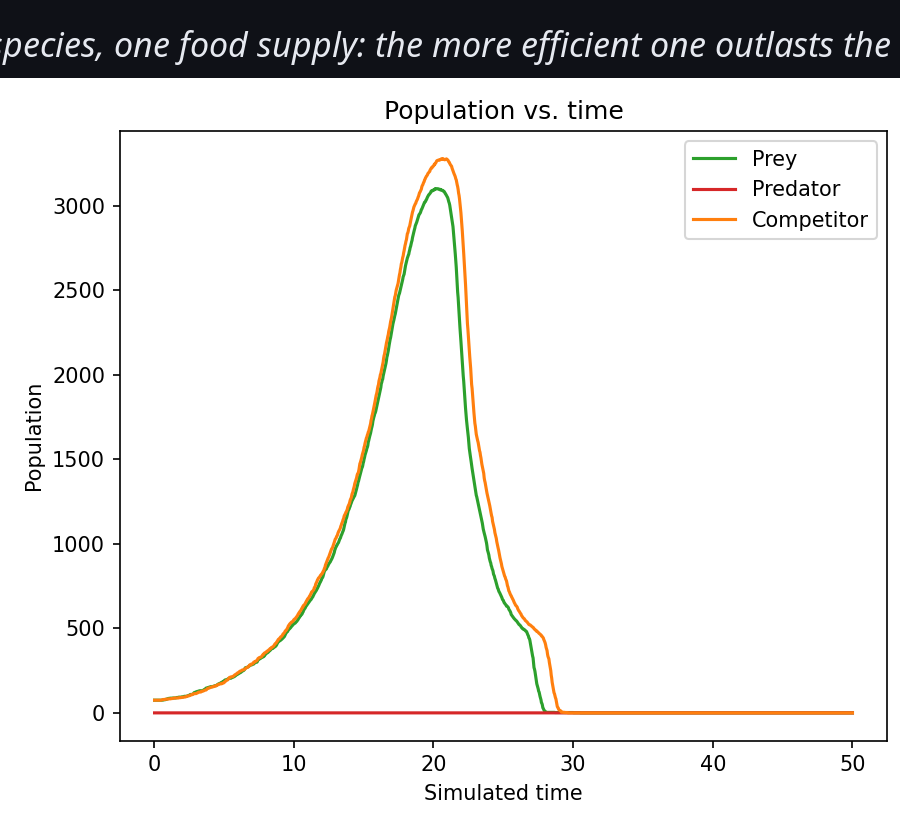
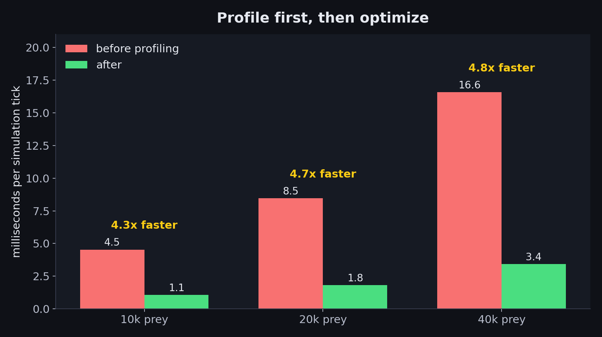

# Ecosystem / Wildlife Simulator

A C++ ecosystem simulation aiming for RimWorld-style **emergent, non-deterministic
behavior**: no scripted events, only independent systems (terrain, populations,
hunger, disease, migration) whose *interactions* produce the story. First entry in a
planned series of simulation games (farm, industry, crime, ...).



## Results

Nothing below is scripted. Each behavior falls out of local rules, and each one is checked
against either an exact result or a control run (see `tests/`).

**Boom and bust.** Phase 1 reproduced the classic Lotka-Volterra predator-prey oscillation
(and its famous instability). Once food is limited by real vegetation, the same rules
collapse the way overgrazed systems do -- a tragedy of the commons. Predators feed on
kills and starve when the prey crash (their energy reserve is the right-hand panel).



**Disease depends on crowding.** An SIR epidemic where infection risk scales with the
number of infected animals sharing your cell, so the epidemic threshold is
`R0 = transmissionRate * S0 / (recoveryRate + diseaseDeathRate)`. The same pathogen
fizzled in a sparse world and took off in a crowded one.



**A seasonal rhythm nobody programmed.** A latitude temperature gradient makes the season
slide the band of fastest regrowth north and south. Animals only ever step toward greener
neighboring cells, yet the herd's mean latitude oscillates at the seasonal period -- 18x
more than with movement switched off, and with the same phase in every seed. It lags the
growth band and moves less far than it does; it does not track it perfectly.



**Competitive exclusion.** Two herbivores share one food supply. Identical species split
evenly (11 vs 9 wins over 20 seeds, a fair coin); give one a 10% cheaper metabolism and it
outlasts the other in 20 of 20 runs (Gause's principle).



## Design Pillars

1. **No scripted outcomes.** Every event (boom, crash, extinction) falls out of rules,
   never a hand-triggered script.
2. **Validate against real math first.** A 2-species (predator/prey) run with no
   terrain must reproduce classic Lotka-Volterra oscillations before adding
   complexity.
3. **Data-oriented over object-oriented.** Contiguous arrays of components over deep
   class hierarchies, so large populations (10k+ agents) stay tractable.
4. **Simulation and rendering are decoupled.** The core sim runs headless;
   visualization is an optional layer on top.

## Tech Stack

| Purpose | Library |
|---|---|
| Language/standard | C++20 |
| Build system | CMake + vcpkg |
| ECS | [EnTT](https://github.com/skypjack/entt) |
| Rendering + live HUD/graphs | [raylib](https://www.raylib.com/) *(render feature)* |
| Logging | [spdlog](https://github.com/gabime/spdlog) |
| Testing | [Catch2](https://github.com/catchorg/Catch2) |
| Config + save/load | [nlohmann/json](https://github.com/nlohmann/json) |

## Building

Prerequisites: CMake 3.21+, a C++20 compiler, and [vcpkg](https://vcpkg.io) with
`VCPKG_ROOT` set in your environment.

```bash
cmake --preset default
cmake --build --preset default
ctest --preset default
```

The renderer is an optional vcpkg feature:

```bash
cmake --preset default -DVCPKG_MANIFEST_FEATURES="render"
```

## Architecture

- `src/components/` — plain-data ECS components ([Components.h](src/components/Components.h)): `Position`, `Species`, `Energy`, `Age`, `GeneticTraits`, `Health`, `Reproductive`.
- `src/environment/` — the terrain grid ([Grid.h](src/environment/Grid.h)), a flat `std::vector<Cell>` kept outside the ECS for cache locality, plus [`generateBiomes`](src/environment/Biomes.h) (smooth seeded noise split by quantile into Desert/Plains/Forest/Wetland).
- `src/systems/` — one class per system, run in a fixed order each tick: `EnvironmentSystem` -> `ForagingSystem` -> `PredationSystem` -> `ReproductionSystem` -> `DiseaseSystem` -> `MigrationSystem` -> `MortalitySystem`.
- `src/core/` — [`Simulation`](src/core/Simulation.h) owns the `entt::registry` and `Grid` and drives the tick loop; `MetricsRecorder` snapshots state for validation.
- `src/render/` — optional [`Viewer`](src/render/Viewer.h): a raylib top-down grid renderer with a live HUD, population graph, and keyboard-tunable parameters, only linked into `ecosystem_viewer` when the `render` feature is enabled. No Dear ImGui/ImPlot -- vcpkg has no raylib/ImGui bridge, so the HUD/graphs/controls are drawn with raylib's own primitives and keyboard input instead of a GUI panel.
- `src/bench/` — `ecosystem_bench`, the Phase 7 profiling harness (per-system timings, thread scaling, multi-replicate sweeps).
- `tests/` — Catch2 unit tests, especially for the math-heavy growth/predation logic.
- `data/` — scenario files (`ecosystem_sim --config data/competition.json`); see [Configuration and saves](#configuration-and-saves).
- `tools/` — CSV-to-plot scripts for validating population dynamics (Phase 1).

## Configuration and saves

Every tunable lives in one `SimulationConfig` that can be loaded from JSON. Files are
*partial*: leave a key out and it keeps its default (`ecosystem_sim --dump-config` prints
them all), and a misspelled key is an error rather than silently ignored.

```bash
ecosystem_sim --config data/competition.json --ticks 900 --save run.json
ecosystem_sim --load run.json --ticks 900          # continues bit-identically
```

A save captures the parameters, clock, the RNG's full state, the terrain, and every
animal in the order the systems visit them, so a resumed run is indistinguishable from
one that never stopped (`tests/test_persistence.cpp` requires exact equality). Shipped
scenarios: `crowded_outbreak` (Phase 4), `seasonal_herd` (emergent seasonal migration),
`competition` (competitive exclusion), `biomes`. In the viewer: `K` saves, `L` loads,
`G` toggles the climate gradient, `C` adds competitors.

## Performance

Phase 7 was profile-driven: `Simulation` records wall-clock time per system, and
`ecosystem_bench [prey] [gridSide] [ticks] [threads]` reports where a tick goes. Same
scenario before and after (ms per tick, single-threaded unless noted):

| Prey (avg entities) | Before | After | After, 12 threads |
|---|---|---|---|
| 10k (12.8k) | 4.53 | 1.06 | 0.91 |
| 20k (24k) | 8.46 | 1.81 | 1.65 |
| 40k (45k) | 16.57 | 3.43 | 2.90 |



What the profile found, and what fixed it:

1. **Disease was 54% of the tick.** It rebuilt an `unordered_map` of per-cell vectors
   every tick even with nobody infected. Now: a flat per-cell array, one early-exit
   pass, and no allocation (5.7x faster).
2. **Predation drew a random number and called `pow()` for every prey** just to pick a
   few dozen victims. Now: prefix sums plus a binary-search draw per victim (6.5x
   faster). The new sampler is proven equal to the old one by
   `tests/test_weighted_sampling.cpp`, which checks both code paths against exact
   brute-force inclusion probabilities.
3. **Cache misses, not arithmetic, dominated the per-prey scans.** EnTT views walk one
   component pool and do a sparse lookup into the others, and the pools drift out of
   order as animals are born and die. An *owning group* (`components/PreyGroup.h`) keeps
   Position/Energy/GeneticTraits/Health/Species physically aligned; foraging got 3.2x faster
   from that change alone. This is the "data-oriented" design pillar, measured.
4. **Threads (`core/ThreadPool.h`)** run the systems that are safe to parallelize:
   environment (each cell is independent) and migration (reads the grid, writes only its
   own prey). Work is split into fixed-size chunks with pre-assigned RNG seeds, never by
   thread, so **results are bit-identical at any thread count**
   (`tests/test_parallel.cpp`) and the code is clean under ThreadSanitizer.
   Migration scales 5.3x at 12 threads, but the whole tick gains only ~15-20%: foraging
   (prey in a cell share one vegetation value), reproduction and predation (they create
   and destroy entities) are inherently serial, so Amdahl's law caps in-tick speedup.
5. **The big multiplier is parallel replicates**, since independent simulations share
   nothing: `ecosystem_bench sweep 48 600 12` runs 48 seeded simulations 6.2x faster on
   12 threads (this CPU has 6 physical cores) with identical results.

Not done, deliberately: spatial partitioning for neighbor queries. Nothing here does
neighbor searches over entities -- disease and migration are already per-cell lookups
into flat arrays, and predation is mean-field -- so there was no O(n^2) to fix.

## Build Phases

- **Phase 0 -- Scaffolding** (this commit): CMake + vcpkg, EnTT/spdlog/Catch2 wired in, empty headless tick loop, `ctest` target.
- **Phase 1 -- Two-species validation**: predator + prey, no terrain, population counts logged to CSV and checked against Lotka-Volterra oscillation. Correctness gate before anything else.
- **Phase 2 -- Spatial grid + vegetation**: `Cell` grid, `ForagingSystem`, `EnvironmentSystem` regrowth/seasons.
- **Phase 3 -- Genetics**: per-individual `GeneticTraits` mutation on reproduction; check trait drift under selection pressure.
- **Phase 4 -- Disease (SIR)**: `Health`/infection system, validated against known SIR dynamics.
- **Phase 5 -- Migration**: gradient-following movement; watch for clustering/resource collapse.
- **Phase 6 -- Visualization**: raylib grid renderer + live population graph, drawn with raylib's own primitives; keyboard-tunable parameters (vegetation regrowth, disease transmission, migration rate) and a manual outbreak trigger. Build with `-DVCPKG_MANIFEST_FEATURES=render` and run `ecosystem_viewer`.
- **Phase 7 -- Performance**: profiled at 10k-250k agents (`ecosystem_bench`), then optimized what the profile pointed at -- see [Performance](#performance).
- **Phase 8 -- Expansion**: multiple biomes, seasonal migration that emerges from a latitude climate gradient (nothing scripted), a second competing herbivore species (competitive exclusion), and JSON config plus exact save/load -- see [Configuration and saves](#configuration-and-saves).

## Open Decisions

Tracked here until resolved in an implementation pass:

- **Agent-based vs. population-based for v1.** Agent-based (every animal is an ECS
  entity) is richer/more emergent but more expensive. Current plan: start
  population-based for the Phase 1 Lotka-Volterra validation, then move to
  agent-based once the math is trusted.
- **Grid size / target population scale**, which determines whether naive O(n^2)
  neighbor checks are acceptable early on or spatial partitioning is needed from
  day one.
- **Seasons/weather**: resolved -- deterministic sinusoidal cycle (Phase 2); it drives seasonal migration through the latitude gradient (Phase 8).
